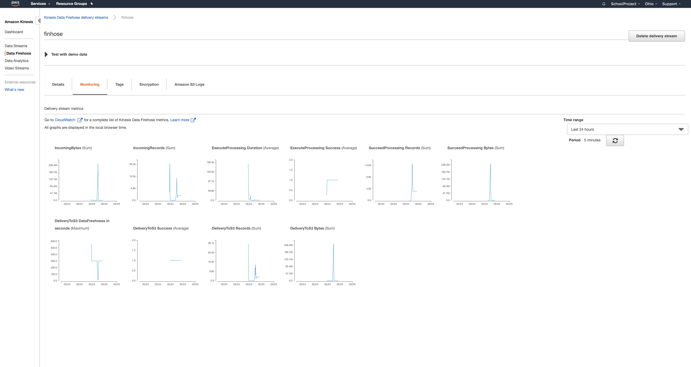
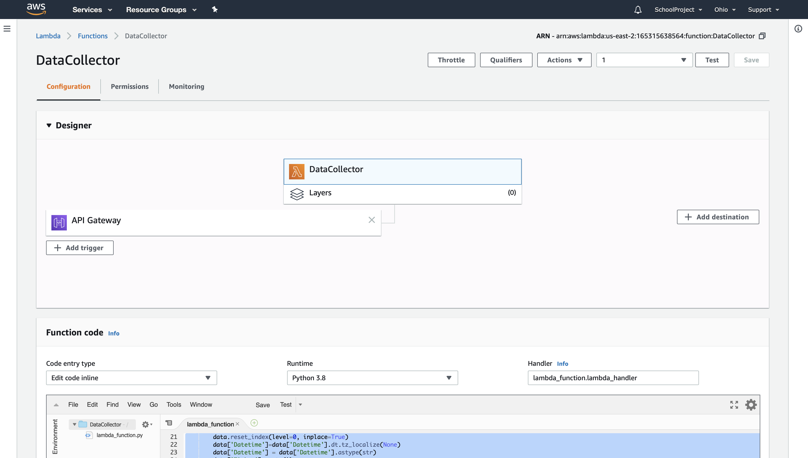

# YFinance Data Processing and Analysis

In this  mini-project,  we are going to  take data from  Yfinance module,  push it to S3 storage using AWS Kinesis, 
and AWS Lambda function. 

This  data will later be crawled and processed by AWS Glue,  which  then will make it ready for querying by  AWS Athena and further
visual  analysis by  various  python packages like pandas, numpy,matplotlib, etc.

Relatively easy  solution  for quick  data data streaming and processing for further analysis and visualisations. 

Tech Stack: AWS Cloud (  Athena, Glue, Kinesis, Lambda, S3) for intake and processing, and various  python packages 
(pandas, matplolib) for data analysis and visualisation.

Screenshot 1 (Lambda Monitoring Logs):

Screenshot 2(lambda setup):

